# Current drone processing flowchart

This diagram reflects both supported runtime modes. Solid arrows show data flow;
dashed arrows show controls, configuration, or optional assistance.

```mermaid
flowchart LR
    subgraph PI["Raspberry Pi / drone"]
        direction TB
        subgraph CAPTURE["Shared capture"]
            direction LR
            ORBBEC[/"Orbbec RGB-D camera"/] --> ORBBEC_DRIVER["Orbbec ROS 2 driver"]
            ORBBEC_DRIVER -->|"RGB + registered depth + intrinsics"| PAIR["Timestamp association<br/>≤ 35 ms"]
            THERMAL[/"MI0802 thermal camera"/] --> THERMAL_DRIVER["MI0802 ROS 2 driver<br/>vertical flip"]
            THERMAL_DRIVER -->|"latest temperatures"| WORKER["Frame-processing worker"]
            GYRO[/"MPU6050 gyroscope"/] --> GYRO_READER["Direct I²C reader<br/>bias calibration"]
            GYRO_READER -->|"angular-rate history"| WORKER
            PAIR -->|"newest RGB-D pair + K"| WORKER
        end

        WORKER --> PREVIEW["RGB / depth / thermal previews"]
        WORKER --> PACKET["DVS1 packet builder"]
        WORKER --> MODE{"Processing mode"}

        MODE -->|"Pi (default)"| PRIOR["Short gyro increment"]
        WORKER --> ODOM["RGB-D visual odometry<br/>PnP default"]
        PRIOR -. "optional prior" .-> ODOM
        ODOM --> TRACKING{"Tracking accepted?"}
        TRACKING -->|"yes"| POSE["6-DoF pose + trajectory"]
        TRACKING -->|"no"| HOLD["Hold pose, freeze map,<br/>attempt recovery"]
        POSE --> MOTION{"Moved > 3 cm<br/>or turned > 0.04 rad?"}
        MOTION -->|"yes"| MAP["Bounded RGB voxel map"]
        MOTION -->|"no"| SKIP["Keep map"]

        PREVIEW --> API["HTTP portal API"]
        POSE --> API
        HOLD --> API
        MAP --> API
        API --> PI_OUT["Web portal / standard DroneView<br/>scene, feeds and PLY export"]

        PACKET --> SENSOR_API["GET /api/sensors"]
        WORKER --> RECORDER["NPZ recorder<br/>up to 300 frames"]
        RESET["Reset / intrinsics change"] -.-> SESSION["New session; clear map,<br/>odometry and alignment"]
        SESSION -.-> WORKER
    end

    subgraph PHONE["LiDAR iPhone / iPad — phone-processing mode"]
        direction TB
        SENSOR_API -->|"Wi-Fi"| DECODE["Decode newest non-stale DVS1 frame"]
        DECODE --> RIG_ODOM["Rig RGB-D odometry<br/>optional gyro assistance"]
        PHONE_CAMERA[/"Phone camera + LiDAR"/] --> ARKIT["ARKit world tracking<br/>phone pose + scene depth"]
        ARKIT --> MATCH["Timestamp-match phone and rig<br/>≤ 100 ms"]
        DECODE --> MATCH
        RIG_ODOM --> ALIGN["Shared-view RGB-D alignment"]
        MATCH --> ALIGN
        ALIGN --> CONFIRM{"3 consistent fits?"}
        CONFIRM -->|"yes"| XFORM["Rig map → ARKit world transform"]
        CONFIRM -->|"no"| WAIT["Hold shared textured view"]
        DECODE -->|"depth + nearest thermal ≤ 150 ms"| FUSION["Thermal/depth projection<br/>temperature voxel map"]
        XFORM --> FUSION
        FUSION --> HEAT["Hot-surface triangles"]
        ARKIT --> RENDER["Metal AR renderer"]
        FUSION --> RENDER
        HEAT --> RENDER
        RENDER --> PHONE_OUT["Phone camera + thermal 3D overlay"]
        XFORM --> POST["POST /api/poses<br/>poses + diagnostics"]
        POST -. "status only; map remains on phone" .-> API
    end

    MODE -->|"Phone: Pi captures/records only"| SENSOR_API

    classDef sensor fill:#e8f3ff,stroke:#2878b5,color:#102a43;
    classDef decision fill:#fff3cd,stroke:#b7791f,color:#5f370e;
    classDef output fill:#e6ffed,stroke:#27864c,color:#123d24;
    class ORBBEC,THERMAL,GYRO,PHONE_CAMERA sensor;
    class MODE,TRACKING,MOTION,CONFIRM decision;
    class PI_OUT,PHONE_OUT output;
```

The Pi-side thermal feed is a preview only. Thermal/depth fusion happens in the
phone-processing branch, and that reconstructed map remains on the phone.
