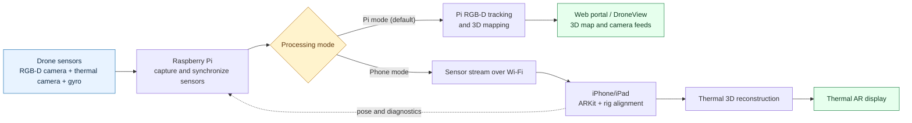

# Simplified drone flowchart

The Pi always captures and synchronizes the drone sensors. In Pi mode it also
tracks and builds the RGB 3D map. In phone mode it streams the sensor data to a
LiDAR iPhone or iPad, where the thermal AR reconstruction is produced.
